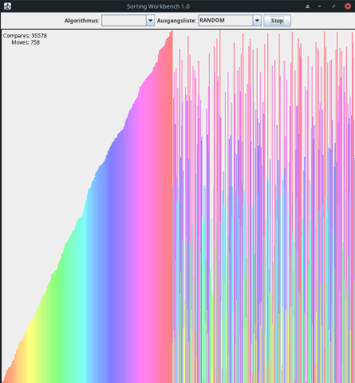
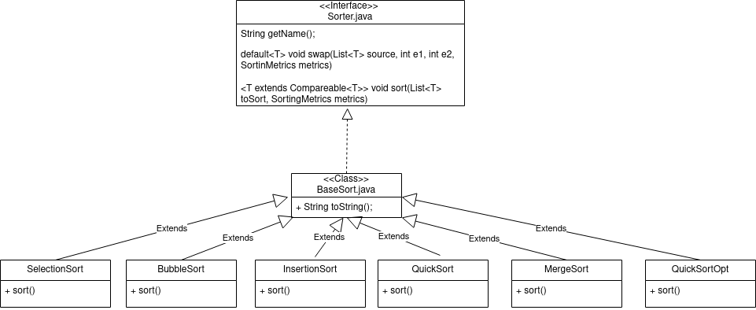

# AD

Algorithmen und Datenstrukturen

Aufgabe 2: SortingWorkbench

Datum: 08.11.2023

Praktikumsgruppe: 3

Teamnummer: ???

Bearbeitet von: Haron Nazari (2686963), Anton Tchekov (2672636)

Build:

`./build.sh`

Run (GUI):

`./run.sh`

# Dokumentation :

## Abstract :

## Einführung :

In diesem Dokument wurde die Komplexität von den folgenden Sortieralgorithmen verglichen:
Selectionsort,
Bubblesort,
Insertionsort,
Mergesort,
Quicksort und einer Kombination aus Quicksort und Insertionsort.

Dabei wurde die Anzahl der Vergleiche und Verschiebungen gemessen bei unterschiedlichen Szenarien.
Die Szenarien sind wie folgt :
Zufällige Liste,
Sortierte Liste,
Teil-Sortierte Liste und
Umgekehrt sortierte Liste mit jeweils größe N.

N hatte dabei 10 verschiedene Werte in aufsteigender Größe... TODO

## Verfahren/Implementation :

Die Algorithmen wurden erstmal jeweils in Java implementiert und mithilfe des SortingWorkbench[1] Tools gemessen
und mithilfe einer Grafischen Oberfläche visualisiert.

Der Aufbau der Sortierklassen ist wie folgt :

### Selectionsort :

### Bubblesort :

### Insertionsort :

### Mergesort :

### Quicksort :

### Quicksort mit Insertionsort :

## Validierung/Tests :

## Quellen :

