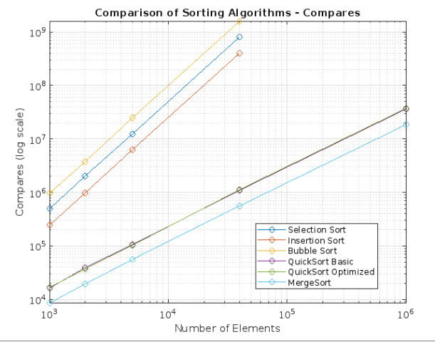
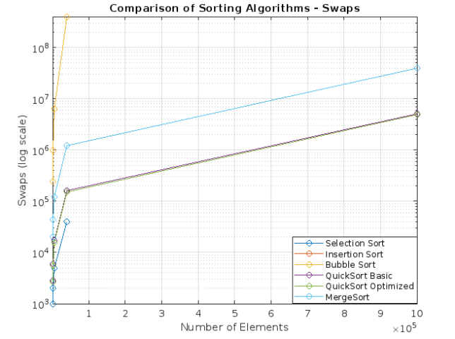
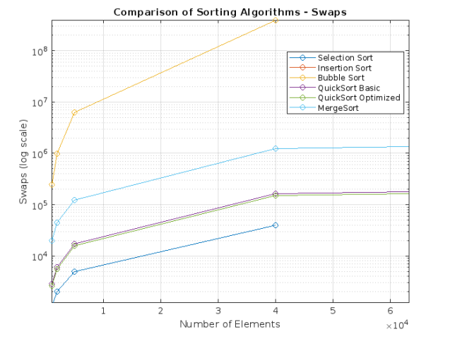

# Algorithmen und Datenstrukturen

Aufgabe 2: SortingWorkbench

Datum: 08.11.2023

Praktikumsgruppe: 3

Teamnummer: ???

Bearbeitet von: Haron Nazari (2686963), Anton Tchekov (2672636)

Build:

`./build.sh`

Run (GUI):

`./run.sh`

# Dokumentation

## Abstract

Im Rahmen der zweiten Praktikumsaufgabe haben wir verschiedene
Sortieralgorithmen in ihrer Effizenz verglichen. Um dabei
einen fairen Vergleich zu ermöglichen, haben wir die Anzahl
der Vergleiche und der Verschiebungen anstelle einer Messung
der Rechenzeit gezählt. Betrachtet wurden SelectionSort,
InsertionSort, BubbleSort, QuickSort, MergeSort und ein
Modifizierter QuickSort Algorithmus.

Wie erwartet schneidet Bubblesort am schlechtesten ab,
während Quicksort und Mergesort am besten sind, da es
sich um `O(n log n)` Algorithmen handelt. Insgesamt
braucht QuickSort in Durchschnitt am wenigsten Operationen.

Ein Optimierter Quicksort-Algorithmus, der bei kleinen
Teillisten InsertionSort nutzt, schneidet nur leicht besser ab.

## Einführung

In diesem Dokument wurde die Komplexität von den folgenden Sortieralgorithmen verglichen:
Selectionsort,
Bubblesort,
Insertionsort,
Mergesort,
Quicksort und einer Kombination aus Quicksort und Insertionsort.

Dabei wurde die Anzahl der Vergleiche und Verschiebungen gemessen bei unterschiedlichen Szenarien.
Die Szenarien sind wie folgt :
Zufällige Liste,
Sortierte Liste,
Teil-Sortierte Liste und
Umgekehrt sortierte Liste mit jeweils größe N.

N hatte dabei 4 oder 5 verschiedene Werte in aufsteigender Größe 1000, 2000, 5000, 40000 und nur für Merge und Quicksort-/Opt 1000000

## Verfahren/Implementation

Die Algorithmen wurden erstmal jeweils in Java implementiert und mithilfe des SortingWorkbench[1] Tools gemessen
und mithilfe einer Grafischen Oberfläche visualisiert.


Der Aufbau der Sortierklassen ist wie folgt :


Alle Implementationen Erben von der gleichen Klasse und werden mithilfe der sort Operation aufgerufen.


### Implementierung von InsertionSort

### Implementierung von SelectionSort

### Implementierung von BubbleSort

### Implementierung von QuickSort

Bei der Implementierung von QuickSort haben wir einen separaten Stack
statt Rekursion verwendet, um den Callstack zu entlasten.
Die nächsten Arbeitsschritte werden immer auf die `Java-Deque` abgelegt.
Als Pivot-Element wird immer ein zufälliger Index gewählt, um den Fall,
dass QuickSort quadratisch wird, sehr unwahrscheinlich zu machen.

```java

	Deque<SubRange> stack = new ArrayDeque<SubRange>();
	stack.addFirst(new SubRange(0, toSort.size() - 1));
	while(!stack.isEmpty())
	{
		SubRange range = stack.removeFirst();
		int start = range.Start;
		int end = range.End;
		if(start >= end)
		{
			continue;
		}

		int pivot = ThreadLocalRandom.current().nextInt(start, end);
		swap(toSort, pivot, end, metrics);
		int s = start;
		int e = end - 1;
		while(s < e)
		{
			while(s < e && compare(toSort, s, end, metrics) <= 0) { ++s; }
			while(e > s && compare(toSort, e, end, metrics) > 0) { --e; }
			if(compare(toSort, s, e, metrics) > 0)
			{
				swap(toSort, s, e, metrics);
			}
		}

		if(compare(toSort, s, end, metrics) > 0)
		{
			swap(toSort, s, end, metrics);
		}
		else
		{
			s = end;
		}

		stack.addFirst(new SubRange(start, s - 1));
		stack.addFirst(new SubRange(s + 1, end));
	}
```

### Implementierung von MergeSort


## Ergebnisse

Wir haben die Algorithmen für die oben beschriebenen Menge and Elementen Laufen lassen und die Werte mithilfe der Metrics klasse
Dokumentieren lassen, die Sortingworkbench hat uns daraufhin die Ergebnisse ausgegeben.

Wir haben die Ergebnisse in 8 Graphen geplottet, dabei steht jedes Paar von Graphen für eine der Kategorien von der
übergebenen Liste wie in der Einführung beschrieben.

Da es sehr viele Daten sind haben wir uns entschieden haupt-vergleiche Vergleiche bei einer Zufällig geordneten Liste
zu ziehen. Dabei sieht man diese erstmal hier geplottet

Comparisons                |  Swaps
:-------------------------:|:-------------------------:
Zufällig Sortierte Liste
   |  

Die X und Y Achsen sind hierbei logarithmisch aufgrund des Starken Wachstums
beider Werte. die X Achse ist die Menge an Elementen in der Liste die zu sortieren ist und an der Y Achse sieht man im linken Graphen die Menge an Vergleichen zwischen Elementen und im rechten Graphen die Menge an Swaps zwischen den Elementen. Man muss hierbei beachten das Quicksort und Mergesort
aufgrund ihrer geringeren Komplexität einen extra Datenpunkt bei Million haben wobei alle anderen bei 40000 aufhören da diese sehr Langsam wurden und nicht mehr Praktisch zu testen waren. Was sofort auffällt bei dem linken Graphen ist das sich 2 "Gruppen" gebildet haben. Einmal mit Selection-,Insertion-, und Bubblesort und Einmal mit Merge-, und Quicksort.

Die erste Gruppe hat dabei eine Komplexität von O(n²), welches man hier sehr gut sehen kann und die zweite Gruppe hat eine Komplexität von O(n log n).

Man kann es hier sehr gut sehen, als auch in unseren Testung haben wir gespürt das größere Listen viel schneller sortieren mithilfe von der zweiten Gruppe und sie somit mehr dafür geeignet sind, dabei müssen wir zugeben das wir die Menge an Dynamischer Speicher allokation die beim Mergesort nötig ist erstmal sehr Skeptisch an sahen, jedoch scheint dies keinen großen einfluss zu haben.

Um uns aber den rechten Graphen besser verstehen zu können müssen wir reinzoomen an dem Anfang.



Bei der Menge der swaps ist es anders and bei der Menge der vergleiche.
Hier ist zu beachten das Bubblesort und Insertion Sort gleiche Werte aufwiesen und diese deshalb deckend sind. Bubble Sort und Insertion Sort haben wie erwartet die höchste Menge an Swaps. Diese sind gefolgt von Mergesort dann den beiden Quicksorts und Selectionsort, da Selection Sort jedes Element nur einmal swappen muss.

Bei zufälligen eingaben sieht man den Vorteil von Merge und Quicksort, jedoch haben sie bei verschiedenen Eingaben auch Nachteile. Denn bei Mergesort ist bestcase = averagecase = worstcase, was heißt das egal was eingegeben wird es immer gleich viel Aufwand betreibt auch wenn sie vorher schon sortiert oder teilsortiert war. Dies gilt auch für Selection sort.

Quicksort ist hingegen bei einer Zufälligen Eingabe
am Langsamsten

`Swaps random: 5135452, ordered: 1263496, reverse: 1503942, partial ord.: 1966946
	Compares random: 36809452, ordered: 25792912, reverse: 26814466, partial ord.: 27367267`

Das kann man hierbei sehen bei dem Test von einer Million Elementen
Zufällige Eingaben waren dabei 2-3 mal Aufwändiger bei Swappen.

Bubblesort und Insertion Sort sind besser bei sortierten oder teil-sortierten Eingaben, jedoch braucht Bubblesort viel mehr Vergleiche als
Insertion sort.

## Validierung/Tests

Wir haben die Vorbedingungen unserer Sortieralgorithmen mit `assert`
abgesichert (dass die zu sortierende List nicht null ist) und mithilfe
von einem JUnit Test überprüft, dass alle Sortieralgorithmen auch
korrekte Ergebnisse liefern. Dazu haben wir den vorgefertigen
ListValidator verwendet.

## Quellen

Vorlesungsfolien
